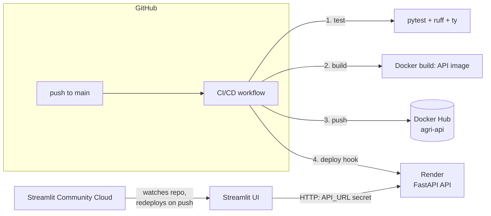

# 🌾 Agri Yield Predictor

[](https://github.com/<owner>/<repo>/actions/workflows/ci-cd.yml)

Predicts and recommends agricultural crop yields from climate and agricultural
data (rainfall, pesticides, temperature) using a trained MLflow model, served
through a FastAPI backend with a Streamlit frontend.

> Replace `<owner>/<repo>` above with this repository's actual path once pushed,
> so the badge resolves.

## Architecture

The API and the frontend are deployed independently — there's no single
"Docker Space" running both, unlike an earlier iteration of this project:



- **API** ([Dockerfile](Dockerfile)): built and pushed to Docker Hub by the CI/CD
  pipeline, then deployed on [Render](https://render.com) (free tier), which pulls
  the new image via a deploy hook the pipeline calls after each push.
- **Frontend** ([src/agri/ui/app.py](src/agri/ui/app.py)): deployed on
  [Streamlit Community Cloud](https://streamlit.io/cloud), connected directly to
  this GitHub repo — it redeploys itself on every push to `main`, independently of
  the GitHub Actions pipeline. It calls the live API over HTTP (`API_URL`,
  configured as a Streamlit secret).

## CI/CD pipeline

Single workflow: [.github/workflows/ci-cd.yml](.github/workflows/ci-cd.yml).

| Job | Trigger | What it does |
|---|---|---|
| `test` | every push, every PR into `main` | `just check-code` (ruff lint), `check-type` (ty), `check-format` (ruff format), `check-coverage` (pytest + coverage ≥80%) — including [tests/api/](tests/api/), the API's critical logic (`predict_yield`, `recommend_crops`, the `/predict` and `/recommend` endpoints). |
| `build-and-push` | push to `main` only | Builds the API's Docker image, pushes `agri-api:latest` and `agri-api:<sha>` to Docker Hub. |
| `deploy` | after `build-and-push` | `curl`s Render's deploy hook, so Render pulls the freshly-pushed image and restarts the API. |
| `notify-on-failure` | any job above fails | Opens (or comments on) a GitHub issue labeled `pipeline-failure`, linking to the failed run — since there's no chat webhook configured for this project. |

`build-and-push` and `deploy` are gated to `main` — pushes to other branches and
PRs only run `test`, so nothing half-finished gets published.

### Required secrets (repo Settings → Secrets and variables → Actions)

| Secret | Used for |
|---|---|
| `DOCKERHUB_USERNAME` | Docker Hub login + image tag namespace |
| `DOCKERHUB_TOKEN` | Docker Hub [access token](https://hub.docker.com/settings/security) (not your password) |
| `RENDER_DEPLOY_HOOK_URL` | Render service → Settings → Deploy Hook |

### Streamlit Community Cloud setup

Connect this repo (main branch, `src/agri/ui/app.py` as the entry point), then
add under the app's Settings → Secrets:

```toml
API_URL = "https://<your-render-service>.onrender.com"
```

## Local development

```bash
uv sync
just app          # FastAPI on :8000, Streamlit on :7860, both from source
```

## Docker (API only)

```bash
just docker-export-model   # bundle the local MLflow "Champion" model into deploy/model/
just docker-build
just docker-run            # API on :8000
```

`just docker-app` builds and runs the API in Docker while running Streamlit
locally against it (`API_URL=http://localhost:8000`) — the closest local
approximation of the deployed split architecture.

See [Dockerfile](Dockerfile) and [docker-compose.yml](docker-compose.yml).
