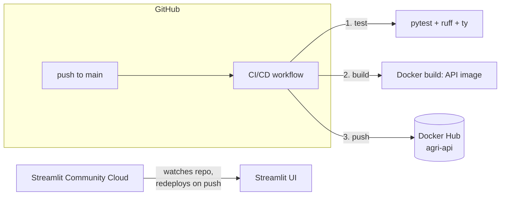

# 🌾 Agri Yield Predictor

[](https://github.com/olivierbinder/agri/actions/workflows/ci-cd.yml)
[](https://olivierbinder.github.io/agri/)

Predicts and recommends agricultural crop yields from climate and agricultural
data (rainfall, pesticides, temperature) using a trained MLflow model, served
through a FastAPI backend with a Streamlit frontend.

📖 Full documentation: [olivierbinder.github.io/agri](https://olivierbinder.github.io/agri/)

## Architecture

The pipeline only handles tests and the API's Docker image — no automated
deployment, this is a learning project:



- **API** ([Dockerfile](Dockerfile)): tested and its Docker image built/pushed
  to Docker Hub by the CI/CD pipeline. Running the image anywhere is a manual
  step, outside this pipeline.
- **Frontend** ([src/agri/ui/app.py](src/agri/ui/app.py)): deployed on
  [Streamlit Community Cloud](https://streamlit.io/cloud), connected directly to
  this GitHub repo — it redeploys itself on every push to `main`, independently of
  the GitHub Actions pipeline and set up separately from it.

## CI/CD pipeline

Single workflow: [.github/workflows/ci-cd.yml](.github/workflows/ci-cd.yml).

| Job | Trigger | What it does |
|---|---|---|
| `test` | every push, every PR into `main` | `just check-code` (ruff lint), `check-type` (ty), `check-format` (ruff format), `check-coverage` (pytest + coverage ≥80%) — including [tests/api/](tests/api/), the API's critical logic (`predict_yield`, `recommend_crops`, the `/predict` and `/recommend` endpoints). |
| `build-and-push` | push to `main` only | Builds the API's Docker image, pushes `agri-api:latest` and `agri-api:<sha>` to Docker Hub. |

`build-and-push` is gated to `main` — pushes to other branches and PRs only
run `test`, so nothing half-finished gets published.

### Required secrets (repo Settings → Secrets and variables → Actions)

| Secret | Used for |
|---|---|
| `DOCKERHUB_USERNAME` | Docker Hub login + image tag namespace |
| `DOCKERHUB_TOKEN` | Docker Hub [access token](https://hub.docker.com/settings/security) (not your password) |

### Streamlit Community Cloud setup

Set up separately from the CI/CD pipeline: connect this repo (main branch,
`src/agri/ui/app.py` as the entry point) in Streamlit Community Cloud, then
add under the app's Settings → Secrets:

```toml
API_URL = "https://<wherever-the-api-runs>"
```

## Local development

```bash
uv sync
just app          # FastAPI on :8000, Streamlit on :7860, both from source
```

## Docker (API only)

```bash
just docker-export-model   # bundle the local MLflow "Champion" model into deploy/model/
just docker-build
just docker-run            # API on :8000
```

`just docker-app` builds and runs the API in Docker while running Streamlit
locally against it (`API_URL=http://localhost:8000`) — the closest local
approximation of the deployed split architecture.

See [Dockerfile](Dockerfile) and [docker-compose.yml](docker-compose.yml).
