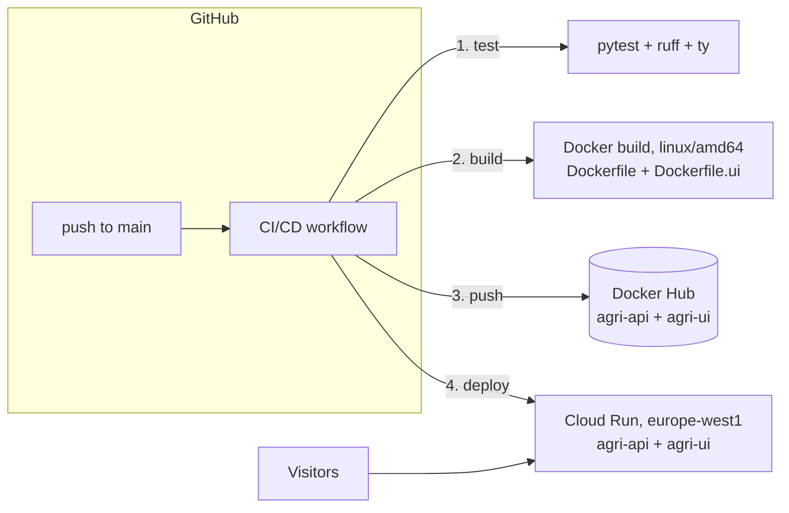

# 🌾 Agri Yield Predictor

[](https://github.com/olivierbinder/agri/actions/workflows/ci-cd.yml)
[](https://olivierbinder.github.io/agri/)

Predicts and recommends agricultural crop yields from climate and agricultural
data (rainfall, pesticides, temperature) using a trained MLflow model, served
through a FastAPI backend with a Gradio frontend.

📖 Full documentation: [olivierbinder.github.io/agri](https://olivierbinder.github.io/agri/)

## Architecture

Two container images, built by the CI/CD pipeline and deployed as two public
[Cloud Run](https://cloud.google.com/run) services. Docker Hub is only the registry
in between, so nothing has to be built on a local machine:


```mermaid
flowchart LR
    subgraph GH[GitHub]
        push[push to main] --> ci[CI/CD workflow]
    end

    ci -->|1. test| tests[pytest + ruff + ty]
    ci -->|2. build| build[Docker build, linux/amd64<br/>Dockerfile + Dockerfile.ui]
    ci -->|3. push| hub[(Docker Hub<br/>agri-api + agri-ui)]
    ci -->|4. deploy| run[Cloud Run, europe-west1<br/>agri-api + agri-ui]

    visitors[Visitors] --> run
```

- **API** ([Dockerfile](Dockerfile)): FastAPI serving the Champion model bundled in the
  image (`deploy/model/`).
  → <https://agri-api-28873275232.europe-west1.run.app> (interactive docs at `/docs`)
- **Frontend** ([Dockerfile.ui](Dockerfile.ui)): Gradio, in its own much lighter image (no
  ML stack), deployed as a second Cloud Run service and pointed at the API at deploy time
  through the `API_URL` environment variable.
  → <https://agri-ui-28873275232.europe-west1.run.app>

## CI/CD pipeline

Single workflow: [.github/workflows/ci-cd.yml](.github/workflows/ci-cd.yml).

| Job | Trigger | What it does |
|---|---|---|
| `test` | every push, every PR into `main` | `just check-code` (ruff lint), `check-type` (ty), `check-format` (ruff format), `check-coverage` (pytest + coverage ≥80%) — including [tests/api/](tests/api/), the API's critical logic (`predict_yield`, `recommend_crops`, the `/predict` and `/recommend` endpoints). |
| `build-and-push` | push to `main` only | Builds the API image (`Dockerfile`) and pushes `agri-api:latest` + `agri-api:<sha>` to Docker Hub. |
| `build-and-push-ui` | push to `main` only | Same for the Gradio UI image (`Dockerfile.ui`, `agri-ui`), with its own build-cache scope. |
| `deploy` | after both builds | Keyless GCP auth ([Workload Identity Federation](https://cloud.google.com/iam/docs/workload-identity-federation), no service-account key) then `gcloud run deploy` for both services; the UI receives the API's URL in `API_URL`. |
| `notify-on-failure` | any job above fails | Opens (or comments on) a `pipeline-failure` issue with the failed steps' logs. |

`build-and-push*` and `deploy` are gated to `main` — pushes to other branches and PRs only
run `test`, so nothing half-finished gets published.

### Required secrets (repo Settings → Secrets and variables → Actions)

| Secret | Used for |
|---|---|
| `DOCKERHUB_USERNAME` | Docker Hub login + image namespace (`olivierrr`) |
| `DOCKERHUB_TOKEN` | Docker Hub [access token](https://hub.docker.com/settings/security) (not your password) |
| `GCP_PROJECT_ID` | Google Cloud project hosting the Cloud Run services |
| `GCP_WORKLOAD_IDENTITY_PROVIDER` | WIF provider, `projects/<number>/locations/global/workloadIdentityPools/<pool>/providers/<provider>` |
| `GCP_SERVICE_ACCOUNT` | Deployer service account, `github-deployer@<project>.iam.gserviceaccount.com` |

### Deployment (Docker Hub → Cloud Run)

The images are pushed to Docker Hub by the CI, then pulled by Cloud Run — no local build
needed, and no registry credentials on Cloud Run because both repositories are public:

- **Images are `linux/amd64`**: Cloud Run does not run arm64 images, so a local build on an
  Apple Silicon Mac must use `docker build --platform linux/amd64`. The GitHub runners are
  amd64, so the CI gets this for free.
- **Images are referenced by digest, not by tag**: Cloud Run resolves Docker Hub images
  through the `mirror.gcr.io` pull-through cache, which can keep serving the manifest of a
  previously deployed tag. `docker/build-push-action` exposes the digest of what it pushed,
  and the `deploy` job deploys `…/agri-api@sha256:…` — content-addressed, so it can never be
  stale.
- **Cloud Run settings** (see the `deploy` job): public access (`--allow-unauthenticated`),
  `--memory 1Gi --cpu 1`, **`--min-instances 0`** (scales to zero, so nothing is billed when
  idle), `--max-instances 2` (API) / `1` (UI) as a cost ceiling, `--cpu-boost` to shorten
  cold starts, `--concurrency 20` for the CPU-bound API.
- **Cold starts**: with `min-instances=0` the first request after an idle period takes a few
  seconds to wake the service (the API also loads the model on its first prediction). Keeping
  an instance warm would be billed continuously, so a portfolio app accepts the wait.
- **Cost**: the Cloud Run free tier (180,000 vCPU-seconds, 360,000 GiB-seconds, 2 M requests
  per month, resets monthly per billing account) covers this workload; the guardrails are
  `min-instances=0` plus low `max-instances`. Region `europe-west1` is set once, in the
  `REGION` env of the `deploy` job.

The one-time GCP setup (WIF pool/provider, deployer service account) and the manual
deployment commands are documented in [docs/05_cicd.md](docs/05_cicd.md).

## Local development

```bash
uv sync
just app          # FastAPI on :8000, Gradio on :7860, both from source
```

## Docker (local, for debugging)

The images that get deployed are built by the CI — building locally is only useful to debug a
Dockerfile. On Apple Silicon, remember that Cloud Run only runs amd64:

```bash
just docker-export-model     # bundle the local MLflow "Champion" model into deploy/model/
just docker-build            # API image (Dockerfile), native platform
just docker-build-ui         # UI image (Dockerfile.ui)
just docker-run              # API on :8000
just docker-run-ui           # UI on :7860, calling the API on the host

# exact reproduction of what the CI pushes (amd64, no attestation):
docker build --platform linux/amd64 --provenance=false -t agri-api .
docker build --platform linux/amd64 --provenance=false -f Dockerfile.ui -t agri-ui .
```

`just docker-app` builds and runs the API in Docker while running Gradio locally against it
(`API_URL=http://localhost:8000`) — the closest local approximation of the deployed split
architecture. See [Dockerfile](Dockerfile), [Dockerfile.ui](Dockerfile.ui) and
[docker-compose.yml](docker-compose.yml).
