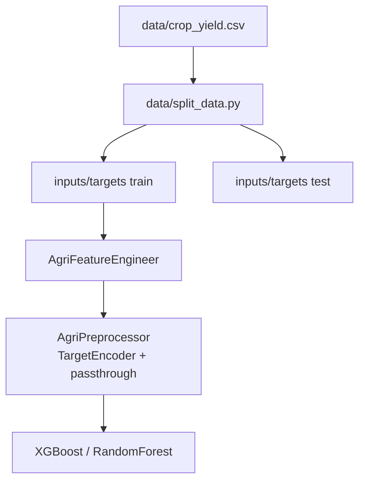

# Conception du modèle

<div style="padding: 1rem 1.25rem; border-left: 0.28rem solid #448aff; background: rgba(68, 138, 255, 0.10); border-radius: 0.25rem; font-size: 1.08rem; line-height: 1.5;">
Un pipeline reproductible, tracé de bout en bout dans <strong>MLflow</strong> : préparation des données, feature engineering métier, tuning systématique, entraînement et promotion du modèle.
</div>

## Préparation des données et feature engineering

[](https://pandas.pydata.org/)
[](https://scikit-learn.org/)



- `AgriFeatureEngineer` ([src/agri/core/features.py](../src/agri/core/features.py)) crée trois variables métier : `rain_temp_interaction`, `rain_efficiency` (pluie / (température + 10)), et `temp_deviation` (écart absolu à la température optimale de la culture, `CROP_OPT_TEMPS`).
- `AgriPreprocessor` encode `Area` et `Item` avec un `TargetEncoder` (validation croisée à 5 folds, pour éviter le leakage), et passe les variables numériques telles quelles.
- Les schémas d'entrée/sortie sont validés avec `pandera` (`InputsSchema`, `TargetsSchema`, `OutputsSchema`).
- `data/split_data.py` sépare train/test **par année**, pas aléatoirement : `TEST_YEAR_START = 2013` isole la dernière année (2013 seule) comme holdout final, tout le reste (1990-2012) allant dans `data/processed/inputs_train.csv`/`targets_train.csv`. Ce n'est pas un choix arbitraire — voir la section Concept Drift ci-dessous.

## Modèles

| Modèle | Rôle | Fichier |
| --- | --- | --- |
| `RandomForest` | Baseline scikit-learn | [models.py](../src/agri/core/models.py) |
| `XGBoost` | Modèle de production | [models.py](../src/agri/core/models.py) |

Les deux modèles partagent la même interface (`fit`, `predict`, `explain_model`, `explain_samples`) et le même préprocesseur — ils sont interchangeables via un discriminant Pydantic (`KIND`) dans la config YAML.

## Entraînement et suivi MLflow

[](https://xgboost.readthedocs.io/)
[](https://mlflow.org/)

Deux jobs MLflow distincts, tracés dans des runs séparés :

| Job | Config | Rôle |
| --- | --- | --- |
| `TuningJob` | [confs/tuning.yaml](../confs/tuning.yaml) | Recherche d'hyperparamètres par `RandomizedCVSearcher` (30 combinaisons tirées), validée sur un `RollingWindowSplitter` (fenêtre d'entraînement fixe de 5 ans, test sur **1 an**, glissant sur 1990-2012 → 17 folds) |
| `TrainingJob` | [confs/training.yaml](../confs/training.yaml) | Entraînement final sur 100% des `training_window_years` dernières années distinctes (5 par défaut), avec `use_best_from_tuning: true` |

`TrainingJob`, quand `use_best_from_tuning: true`, va chercher les hyperparamètres du run `TuningJob` **le plus récent** de la même expérience MLflow (`search_runs` trié par `start_time`, pas par score — comparer des scores entre deux protocoles de CV différents n'a pas de sens), les applique au modèle, puis l'entraîne, le signe (`InferSigner`) et l'enregistre dans le **MLflow Model Registry**. Quand `use_best_from_tuning: false`, ce sont les hyperparamètres renseignés directement dans la section `model:` de `training.yaml` qui sont utilisés tels quels (aucun run de tuning n'est consulté).

**État actuel** (dernier run, cf. MLflow) : CV tuning `RMSE_tune_mean_best` ≈ 16 606 (moyenne sur les 17 folds à 1 an), évaluation sur le holdout 2013 : `RMSE_test` ≈ 19 653, `R2_test` ≈ 0.959.

```json
{
  "prediction": 34521.7,
  "unit": "hg/ha"
}
```

## Promotion et explicabilité

- `PromotionJob` ([confs/promotion.yaml](../confs/promotion.yaml)) sélectionne, parmi les versions enregistrées, celle avec le meilleur `R2_test`, et lui assigne l'alias **`Champion`** — c'est cette version que l'API charge.
- `ExplanationsJob` ([confs/explanations.yaml](../confs/explanations.yaml)) calcule les importances de features et les valeurs SHAP (`shap.TreeExplainer`) sur un échantillon du jeu de test.

??? info "Annexes"

    ## Concept Drift : pourquoi une fenêtre glissante de 5 ans, et un holdout d'1 an

    Le notebook [notebooks/agri.ipynb](../notebooks/agri.ipynb) établit deux résultats complémentaires, tous deux liés à une dérive temporelle des rendements (les rendements progressent structurellement d'année en année, donc les vieilles données d'entraînement deviennent de moins en moins représentatives) :

    - **Section WINDOW OPTIMUM** : en moyennant le RMSE sur jusqu'à 19 folds glissants répartis sur tout l'historique (1990-2013), une fenêtre d'entraînement fixe de **5 ans** minimise le RMSE (20 652 ± 1 306), et la performance se dégrade progressivement avec des fenêtres plus longues, jusqu'à entraîner sur tout l'historique (23 826 pour 20 ans).
    - **Analyse d'erreur du modèle final** : la MAE se dégrade progressivement de 2010 à 2013 quand un même modèle, entraîné une seule fois, est utilisé pour prédire des années de plus en plus lointaines — la conclusion explicite du notebook est qu'"il est indispensable de ré-entraîner régulièrement le modèle chaque année avec les dernières données récoltées".

    Ces deux résultats motivent l'architecture actuelle :

    - `TrainingJob` n'entraîne le modèle final que sur les 5 dernières années distinctes (`training_window_years: 5`) — c'est le modèle **déployé**, celui qui doit être le plus proche possible des conditions actuelles.
    - `TuningJob`, lui, peut se permettre de balayer tout l'historique disponible (1990-2012) pour choisir les hyperparamètres : ce qu'on y mesure n'est pas "quel est le bon rendement" (qui dérive), mais "quelle capacité de modèle convient à un entraînement sur ~5 ans / ~6000 lignes sans sur-apprendre" — une question beaucoup plus stable dans le temps. Le `RollingWindowSplitter` y simule exactement le scénario de déploiement réel : `window=5, test_size=1` — entraîner sur 5 ans, tester sur l'année suivante — glissé sur tout l'historique (17 folds).
    - Le holdout final (`data/processed/inputs_test.csv`) ne contient donc plus qu'**une seule année** (2013) : c'est le test le plus fidèle au vrai cas d'usage (ré-entraîner chaque année, prédire l'année suivante), mais aussi un test de fumée avant déploiement plutôt qu'une preuve statistique — une seule année reste une réalisation unique, sujette à ses propres aléas (climat, marché). Le score moyen (et l'écart-type) de la CV du tuning sur 17 folds reste la mesure la plus fiable de la performance attendue.

    ## Méthode d'ajustement des hyperparamètres

    - `RandomizedCVSearcher` ([src/agri/utils/searchers.py](../src/agri/utils/searchers.py)) s'appuie sur `sklearn.model_selection.RandomizedSearchCV` — tire `n_iter` combinaisons au hasard dans la grille plutôt que de toutes les essayer (`GridCVSearcher`, toujours disponible, reste préférable pour une petite grille qu'on veut explorer exhaustivement).
    - Chaque combinaison testée est loggée comme un run MLflow imbriqué (`nested=True`), avec ses métriques moyenne/écart-type, son temps d'entraînement, et les tags `model_kind`/`splitter_kind`/`preprocessor_kind` — ces runs enfants sont donc filtrables/comparables dans MLflow sans avoir à remonter au run parent.
    - Le splitter par défaut du tuning est `RollingWindowSplitter` : il simule des conditions réalistes (entraîner sur le passé, tester sur l'année suivante) avec une fenêtre d'entraînement de taille **fixe**, plutôt qu'un simple k-fold aléatoire ou une fenêtre qui grossit indéfiniment (`ExpandingWindowSplitter`, conservé pour comparaison/historique).
    - Les fenêtres sont comptées en années **distinctes présentes** dans les données (une année peut être totalement absente, ex. 2003) plutôt qu'en arithmétique calendaire.

    Le notebook documente aussi le RMSE obtenu par fold d'un `ExpandingWindowSplitter`, avec une interprétation métier : les folds couvrant des périodes d'anomalies climatiques (ex. El Niño fin des années 1990) montrent un RMSE significativement plus élevé que les périodes stables.

    ## Modèle final

    - Sauvegardé via le flavor MLflow PyFunc (`CustomSaver`, [src/agri/io/registries.py](../src/agri/io/registries.py)), pas en `.pkl`/`.joblib` brut — le registre MLflow gère le versionnement et les alias directement.
    - `just docker-export-model` télécharge la version `Champion` du registre et la bundle dans `deploy/model/`, pour que l'image Docker de l'API n'ait pas besoin d'un registre MLflow externe au runtime.
