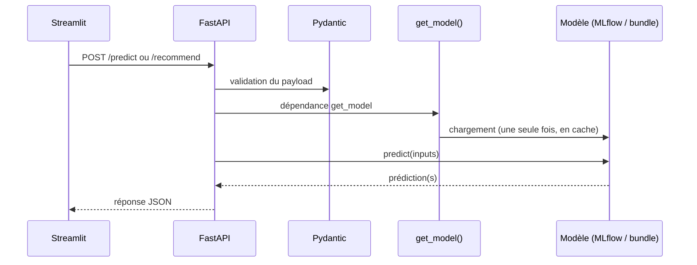

# API FastAPI

<div style="padding: 1rem 1.25rem; border-left: 0.28rem solid #448aff; background: rgba(68, 138, 255, 0.10); border-radius: 0.25rem; font-size: 1.08rem; line-height: 1.5;">
L'API transforme le modèle enregistré dans MLflow en un <strong>service HTTP testable et documenté</strong>.
</div>

## Schéma d'appel

[](https://fastapi.tiangolo.com/)
[](https://docs.pydantic.dev/)



| Route | Rôle |
| --- | --- |
| `/predict` | Rendement prédit (hg/ha) pour un contexte (zone, culture, année, pluie, pesticides, température) |
| `/recommend` | Classement de toutes les cultures connues par score relatif, pour un contexte donné |
| `/docs` | Contrat Swagger auto-généré |

- `Pydantic` verrouille les entrées (`PredictRequest`, `RecommendRequest`) : types, valeurs par défaut, erreurs `422` explicites en cas de payload invalide.
- Le modèle est chargé une seule fois au démarrage (`get_model()`, [src/agri/api/dependencies.py](../src/agri/api/dependencies.py)) puis mis en cache en mémoire — soit depuis un bundle local (`MODEL_URI`, utilisé par l'image Docker), soit depuis le registre MLflow `Champion` (dev local).

## Démo

!!! tip "Démo à ouvrir"
    Lancer l'API avec **`just api`**, puis ouvrir :

    - **Swagger** : [http://localhost:8000/docs](http://localhost:8000/docs)
    - **Endpoint `/predict`** : [http://localhost:8000/predict](http://localhost:8000/predict)

??? info "Annexes"

    ## Logique métier de `/recommend`

    Les rendements bruts ne sont pas comparables entre cultures (la pomme de terre produit ~12x plus que le soja quel que soit le climat). `/recommend` calcule donc un **score relatif** : rendement prédit pour la culture, divisé par le rendement de référence global de cette culture (`constants.CROP_REF_YIELD`). Le classement favorise ainsi les cultures qui performent *mieux que d'habitude* dans le contexte donné, pas juste les cultures naturellement productives. Voir [src/agri/api/logic.py](../src/agri/api/logic.py).

    ## Test rapide en ligne de commande

    ```bash
    curl -X POST "http://localhost:8000/predict" \
      -H "Content-Type: application/json" \
      -d '{"Area": "France", "Item": "Wheat", "Year": 2024, "average_rain_fall_mm_per_year": 800, "pesticides_tonnes": 150, "avg_temp": 15}'
    ```

    ## Gestion des erreurs

    - Payload invalide : `422` (validation Pydantic automatique).
    - Erreur de prédiction : `500`.
