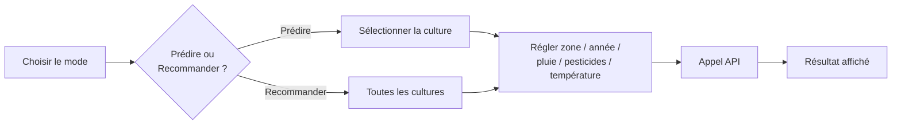

# Application Streamlit

L'application Streamlit rend le modèle <strong>manipulable par un utilisateur métier</strong> : choisir un contexte, prédire un rendement, ou comparer toutes les cultures.

## Parcours utilisateur

- **Mode "🔮 Predict a yield"** : rendement prédit pour la culture choisie, dans le contexte défini via la barre latérale.
- **Mode "🏆 Recommend the best crop"** : classement de toutes les cultures connues par score relatif, avec graphique en barres et tableau détaillé.

## Lien avec l'API

| Endpoint | Usage dans l'app |
| --- | --- |
| `/predict` | Calcule le rendement pour la culture sélectionnée |
| `/recommend` | Classe toutes les cultures pour le contexte courant |

`API_URL` est lu depuis `st.secrets["API_URL"]` (secret Streamlit Cloud) ou la variable d'environnement `API_URL`, avec `http://localhost:8000` par défaut ([src/agri/ui/app.py](../src/agri/ui/app.py)).

## Démo

!!! tip "Démo à ouvrir"
    Lancer l'application avec **`just ui`** (ou `just app` pour API + UI ensemble), puis ouvrir :

    - **Application Streamlit** : [http://localhost:8501](http://localhost:8501)

??? info "Annexes"

    ## Déploiement

    L'application est déployée sur **Streamlit Community Cloud**, connectée directement à ce dépôt GitHub — elle se redéploie automatiquement à chaque push sur `main`, indépendamment du pipeline CI/CD (qui, lui, ne s'occupe que de l'API).

    ## Gestion des erreurs

    Si l'API n'est pas joignable à `API_URL` (ex. non déployée), l'app affiche un message d'erreur explicite (`requests.exceptions.ConnectionError`) plutôt que de planter.
