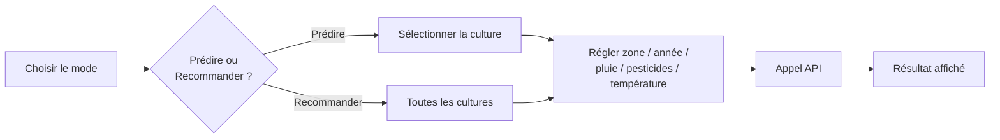

# Application Gradio

L'application Gradio rend le modèle <strong>manipulable par un utilisateur métier</strong> : choisir un contexte, prédire un rendement, ou comparer toutes les cultures.

## Parcours utilisateur

```mermaid
flowchart LR
    A[Choisir le mode] --> B{Prédire ou<br/>Recommander ?}
    B -->|Prédire| C[Sélectionner la culture]
    B -->|Recommander| D[Toutes les cultures]
    C --> E[Régler zone / année /<br/>pluie / pesticides / température]
    D --> E
    E --> F[Appel API]
    F --> G[Résultat affiché]
```

- **Onglet "🔮 Predict a yield"** : rendement prédit pour la culture choisie, dans le contexte défini au-dessus (zone, année, pluie, pesticides, température, partagé entre les deux onglets).
- **Onglet "🏆 Recommend the best crop"** : classement de toutes les cultures connues par score relatif, sous forme de tableau détaillé.

## Lien avec l'API

| Endpoint | Usage dans l'app |
| --- | --- |
| `/predict` | Calcule le rendement pour la culture sélectionnée |
| `/recommend` | Classe toutes les cultures pour le contexte courant |

`API_URL` est lu depuis la variable d'environnement `API_URL` (secret du Space sur Hugging Face), avec `http://localhost:8000` par défaut ([src/agri/ui/app.py](../src/agri/ui/app.py)).

## Démo

!!! tip "Démo à ouvrir"
    Lancer l'application avec **`just ui`** (ou `just app` pour API + UI ensemble), puis ouvrir :

    - **Application Gradio** : [http://localhost:7860](http://localhost:7860)

??? info "Annexes"

    ## Déploiement

    L'application est déployée comme **Hugging Face Space** (SDK Gradio), poussé manuellement depuis ce dépôt — indépendamment du pipeline CI/CD (qui, lui, ne s'occupe que de l'API).

    ## Gestion des erreurs

    Si l'API n'est pas joignable à `API_URL` (ex. non déployée), l'app affiche un message d'erreur explicite (`gr.Error`, levé sur `requests.exceptions.RequestException`) plutôt que de planter.
