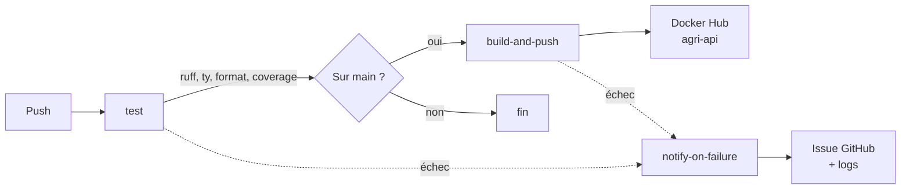

# CI/CD

La chaîne CI/CD garantit que l'API est <strong>testée et packagée de façon reproductible</strong> à chaque push, avec une notification automatique en cas d'échec.

## Workflow

| Job | Déclencheur | Rôle |
| --- | --- | --- |
| `test` | Chaque push, chaque PR vers `main` | Lint (`ruff check`), typage (`ty`), format (`ruff format --check`), tests + couverture (`pytest --cov`, seuil 80%) — dont [tests/api/](../tests/api/) sur la logique critique de l'API |
| `build-and-push` | Push sur `main` uniquement | Build l'image Docker de l'API, la pousse sur Docker Hub (`agri-api:latest` et `agri-api:<sha>`) |
| `notify-on-failure` | `test` ou `build-and-push` échoue | Récupère les logs des étapes en échec et ouvre/commente une issue GitHub |

`build-and-push` est limité à `main` : les PR et les autres branches ne lancent que `test`, pour ne rien publier de non validé.

**Pas de déploiement automatisé dans ce pipeline** — volontairement, pour cet exercice : l'image publiée sur Docker Hub est prête à être déployée, mais le déploiement effectif (choix d'hébergeur, redémarrage du service) se fait manuellement, en dehors de la CI/CD. Le frontend Streamlit est géré à part (voir [Application](04_prediction.md)).

## Notification d'échec

Le job `notify-on-failure` se déclenche dès que `test` ou `build-and-push` échoue (`if: always() && contains(needs.*.result, 'failure')`) :

1. `gh run view --log-failed` récupère les logs des étapes en échec du run courant.
2. Les 5000 derniers caractères sont inclus dans le corps de l'issue, dans une section repliable.
3. Une issue étiquetée `pipeline-failure` est créée, ou commentée si elle existe déjà (pour ne pas spammer à chaque échec consécutif).

## Démo

!!! tip "Démo à ouvrir"
    - **Runs GitHub Actions** : [github.com/olivierbinder/agri/actions](https://github.com/olivierbinder/agri/actions)

??? info "Annexes"

    ## Secrets requis (Settings → Secrets and variables → Actions)

    | Secret | Utilisé pour |
    | --- | --- |
    | `DOCKERHUB_USERNAME` | Connexion Docker Hub + espace de noms des tags |
    | `DOCKERHUB_TOKEN` | Jeton d'accès Docker Hub (pas le mot de passe) |

    ## Fichier

    Le workflow complet est dans [.github/workflows/ci-cd.yml](../.github/workflows/ci-cd.yml).
