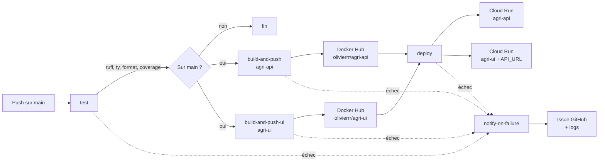

# CI/CD

<div style="padding: 1rem 1.25rem; border-left: 0.28rem solid #448aff; background: rgba(68, 138, 255, 0.10); border-radius: 0.25rem; font-size: 1.08rem; line-height: 1.5;">
La chaîne CI/CD garantit que l'API et l'UI sont <strong>testées, packagées et déployées de façon reproductible</strong> à chaque push sur <code>main</code>, avec une notification automatique en cas d'échec.
</div>

## Workflow

[](https://github.com/features/actions)
[](https://docs.astral.sh/ruff/)
[](https://docs.pytest.org/)
[](https://www.docker.com/)
[](https://cloud.google.com/run)


```mermaid
flowchart LR
    A[Push sur main] --> B[test]
    B -->|ruff, ty, format, coverage| C{Sur main ?}
    C -->|non| Z[fin]
    C -->|oui| D[build-and-push<br/>agri-api]
    C -->|oui| D2[build-and-push-ui<br/>agri-ui]
    D --> H[Docker Hub<br/>olivierrr/agri-api]
    D2 --> H2[Docker Hub<br/>olivierrr/agri-ui]
    H --> E[deploy]
    H2 --> E
    E --> R1[Cloud Run<br/>agri-api]
    E --> R2[Cloud Run<br/>agri-ui + API_URL]
    B -.échec.-> N[notify-on-failure]
    D -.échec.-> N
    D2 -.échec.-> N
    E -.échec.-> N
    N --> I[Issue GitHub<br/>+ logs]
```

| Job | Déclencheur | Rôle |
| --- | --- | --- |
| `test` | Chaque push, chaque PR vers `main` | Lint (`ruff check`), typage (`ty`), format (`ruff format --check`), tests + couverture (`pytest --cov`, seuil 80%) — dont [tests/api/](../tests/api/) sur la logique critique de l'API |
| `build-and-push` | Push sur `main` uniquement | Build l'image de l'API (`Dockerfile`) et la pousse sur Docker Hub (`agri-api:latest` + `agri-api:<sha>`) |
| `build-and-push-ui` | Push sur `main` uniquement | Idem pour l'UI Gradio (`Dockerfile.ui` → `agri-ui`), avec son propre scope de cache de build |
| `deploy` | Après les deux builds | Authentification GCP sans clé (WIF), puis `gcloud run deploy` des deux services ; `API_URL` de l'UI injectée avec l'URL de l'API |
| `notify-on-failure` | Échec de l'un des jobs ci-dessus | Récupère les logs des étapes en échec et ouvre/commente une issue GitHub |

`build-and-push*` et `deploy` sont limités à `main` : les PR et les autres branches ne lancent que `test`, pour ne rien publier de non validé. Le job `deploy` ne se déclenche pas non plus sur un `workflow_dispatch` (la condition exige un `push`).

## Déploiement (Docker Hub → Cloud Run)

Les images ne sont **jamais construites en local** : le runner GitHub (amd64) construit et pousse les deux images sur Docker Hub, puis Cloud Run les tire. Les dépôts étant publics, Cloud Run n'a besoin d'aucun identifiant de registry.

| Élément | Choix | Pourquoi |
| --- | --- | --- |
| Plateforme des images | `linux/amd64` | Cloud Run n'exécute pas d'images arm64 ; un build local sur Mac Apple Silicon doit donc passer `--platform linux/amd64` |
| Référence déployée | **digest** (`…/agri-api@sha256:…`), via la sortie `digest` de `docker/build-push-action` | Cloud Run résout les images Docker Hub à travers le cache *pull-through* `mirror.gcr.io`, qui peut continuer à servir le manifeste d'un tag déjà déployé ; un digest est *content-addressed*, donc jamais périmé |
| Authentification | Workload Identity Federation (OIDC GitHub ↔ GCP) | Aucune clé de compte de service à stocker dans les secrets |
| Accès | `--allow-unauthenticated` | Services publics, portfolio |
| Ressources | 1 vCPU / 1 GiB par instance | Le modèle xgboost tient largement dans 1 GiB |
| Scaling | `--min-instances 0`, `--max-instances 2` (API) / `1` (UI) | 0 instance au repos → 0 € ; le plafond borne un pic de trafic |
| Cold start | `--cpu-boost` | Réveil du service en quelques secondes (l'API charge le modèle à la première prédiction) |

- **API** (`agri-api`) : <https://agri-api-28873275232.europe-west1.run.app> — endpoints `/health`, `/predict`, `/recommend` et `/docs`.
- **UI** (`agri-ui`) : <https://agri-ui-28873275232.europe-west1.run.app> — même URL stable d'une révision à l'autre (elle dépend du nom du service, du projet et de la région).
- La région est définie une seule fois (`REGION: europe-west1` dans le job `deploy`).
- **Coût** : le free tier Cloud Run (180 000 vCPU-s, 360 000 GiB-s, 2 M requêtes par mois, remis à zéro chaque mois et mutualisé par compte de facturation) couvre ce trafic ; les garde-fous sont `min-instances=0` et des `max-instances` faibles.

## Notification d'échec

Le job `notify-on-failure` se déclenche dès que l'un des jobs `test`, `build-and-push`, `build-and-push-ui` ou `deploy` échoue (`if: always() && contains(needs.*.result, 'failure')`) :

1. `gh run view --log-failed` récupère les logs des étapes en échec du run courant.
2. Les 5000 derniers caractères sont inclus dans le corps de l'issue, dans une section repliable.
3. Une issue étiquetée `pipeline-failure` est créée, ou commentée si elle existe déjà (pour ne pas spammer à chaque échec consécutif).

## Démo

!!! tip "Démo à ouvrir"
    - **Runs GitHub Actions** : [github.com/olivierbinder/agri/actions](https://github.com/olivierbinder/agri/actions)
    - **API déployée** : [agri-api-28873275232.europe-west1.run.app](https://agri-api-28873275232.europe-west1.run.app/docs)
    - **Application déployée** : [agri-ui-28873275232.europe-west1.run.app](https://agri-ui-28873275232.europe-west1.run.app)

??? info "Annexes"

    ## Secrets requis (Settings → Secrets and variables → Actions)

    | Secret | Utilisé pour |
    | --- | --- |
    | `DOCKERHUB_USERNAME` | Connexion Docker Hub + espace de noms des images (`olivierrr`) |
    | `DOCKERHUB_TOKEN` | Jeton d'accès Docker Hub (pas le mot de passe) |
    | `GCP_PROJECT_ID` | Projet Google Cloud qui héberge les services Cloud Run |
    | `GCP_WORKLOAD_IDENTITY_PROVIDER` | Fournisseur WIF : `projects/<numéro>/locations/global/workloadIdentityPools/<pool>/providers/<provider>` |
    | `GCP_SERVICE_ACCOUNT` | Compte de service de déploiement : `github-deployer@<projet>.iam.gserviceaccount.com` |

    ## Mise en place GCP (une seule fois)

    ```bash
    PROJECT=agri-binder
    gcloud config set project "$PROJECT"
    gcloud services enable run.googleapis.com iamcredentials.googleapis.com sts.googleapis.com

    # Compte de service de déploiement (rien à voir avec l'identité d'exécution des services)
    gcloud iam service-accounts create github-deployer --display-name="GitHub Actions deployer"
    for role in roles/run.admin roles/iam.serviceAccountUser; do
      gcloud projects add-iam-policy-binding "$PROJECT" \
        --member="serviceAccount:github-deployer@$PROJECT.iam.gserviceaccount.com" \
        --role="$role"
    done

    # Workload Identity Federation : GitHub Actions obtient des jetons éphémères, sans clé
    gcloud iam workload-identity-pools create github --location=global --display-name="GitHub"
    gcloud iam workload-identity-pools providers create-oidc github \
      --location=global --workload-identity-pool=github --display-name="GitHub" \
      --issuer-uri="https://token.actions.githubusercontent.com" \
      --attribute-mapping="google.subject=assertion.sub,attribute.repository=assertion.repository"
    gcloud iam service-accounts add-iam-policy-binding \
      "github-deployer@$PROJECT.iam.gserviceaccount.com" \
      --role=roles/iam.workloadIdentityUser \
      --member="principalSet://iam.googleapis.com/projects/$(gcloud projects describe $PROJECT --format='value(projectNumber)')/locations/global/workloadIdentityPools/github/attribute.repository/olivierbinder/agri"
    ```

    Le fournisseur WIF doit ensuite être autorisé côté Workload Identity, et les trois secrets `GCP_*` renseignés dans GitHub. Les services Cloud Run sont créés par le premier déploiement ; la région se règle dans `REGION` (job `deploy`).

    ## Déploiement manuel (avant/au lieu de la CI)

    ```bash
    SHA=$(git rev-parse HEAD)
    gcloud run deploy agri-api \
      --image "docker.io/olivierrr/agri-api:$SHA" \
      --region europe-west1 --allow-unauthenticated \
      --memory 1Gi --cpu 1 --min-instances 0 --max-instances 2 \
      --cpu-boost --timeout 60 --concurrency 20

    API_URL=$(gcloud run services describe agri-api --region europe-west1 --format='value(status.url)')
    gcloud run deploy agri-ui \
      --image "docker.io/olivierrr/agri-ui:$SHA" \
      --region europe-west1 --allow-unauthenticated \
      --memory 1Gi --cpu 1 --min-instances 0 --max-instances 1 \
      --set-env-vars "API_URL=$API_URL"
    ```

    En cas de build local sur Mac Apple Silicon, l'image doit être construite pour amd64 (`docker build --platform linux/amd64 --provenance=false …`), sinon Cloud Run refuse le manifeste. Préférer un **tag inédit** (ou le digest) : un tag déjà déployé peut rester servi par le cache `mirror.gcr.io`.

    ## Alerte budget (recommandée)

    ```bash
    gcloud billing budgets create --billing-account=<ID> \
      --display-name=agri --budget-amount=1EUR \
      --threshold-rule=percent=0.5 --threshold-rule=percent=1.0
    ```

    Une alerte budget prévient par e-mail, elle ne coupe rien : les vrais plafonds sont `--min-instances 0` (rien au repos) et `--max-instances`.

    ## Fichier

    Le workflow complet est dans [.github/workflows/ci-cd.yml](../.github/workflows/ci-cd.yml).
