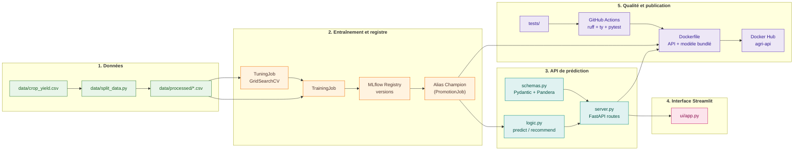

# Structure du dépôt et synthèse

<div style="padding: 1rem 1.25rem; border-left: 0.28rem solid #448aff; background: rgba(68, 138, 255, 0.10); border-radius: 0.25rem; font-size: 1.08rem; line-height: 1.5;">
Le dépôt suit les étapes du projet : <strong>données → modèle → API → interface → CI/CD</strong>.
</div>

## Vue rapide

### Données et modèle

```text
agri/
|-- data/
|   |-- crop_yield.csv        # dataset FAO brut
|   `-- processed/            # inputs/targets train/test
|-- confs/                    # config YAML de chaque job (Pydantic + discriminants KIND)
|   |-- tuning.yaml
|   |-- training.yaml
|   |-- evaluations.yaml
|   |-- explanations.yaml
|   |-- promotion.yaml
|   `-- inference.yaml
`-- mlruns.db / mlruns/       # tracking MLflow local
```

### Code applicatif

```text
src/agri/
|-- core/          # features, models, metrics, schemas, constants
|-- io/            # datasets, registries (saver/loader/register), services (MlflowService)
|-- jobs/          # TuningJob, TrainingJob, EvaluationsJob, ExplanationsJob, PromotionJob, InferenceJob
|-- utils/         # splitters, searchers, signers
|-- api/           # server (FastAPI), logic, dependencies
`-- ui/            # app.py (Streamlit)
```

### Exploitation

```text
agri/
|-- tests/                    # miroir de src/agri, dont tests/api/
|-- deploy/model/             # modèle Champion bundlé (pour l'image Docker)
|-- .github/workflows/        # ci-cd.yml, docs.yml
|-- Dockerfile
|-- docker-compose.yml
`-- docs/                     # cette documentation (Zensical)
```

## Schéma final



## Merci

Merci pour votre attention.

??? info "Annexes"

    ## Fichiers racine

    - `pyproject.toml` : dépendances et groupes `check` / `commit` / `dev` / `docs` / `notebook`.
    - `uv.lock` : versions figées pour reproduire l'environnement.
    - `justfile` + `tasks/*.just` : raccourcis `api`, `ui`, `app`, `check`, `docker-*`, `docs-*`, `mlflow-*`.
    - `zensical.toml` : navigation et configuration de cette documentation.
    - `MLproject` + `python_env.yaml` : point d'entrée MLflow Projects pour rejouer un job (`mlflow run . -P conf_file=confs/training.yaml`).

    ## Artefacts de production

    - `deploy/model/` : version `Champion` du registre MLflow, bundlée dans l'image Docker (`just docker-export-model`).
    - `data/processed/*.csv` : jeux d'entraînement/test après feature engineering.
    - `outputs/*.csv` : prédictions et explications générées par `InferenceJob` / `ExplanationsJob`.
