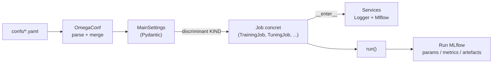
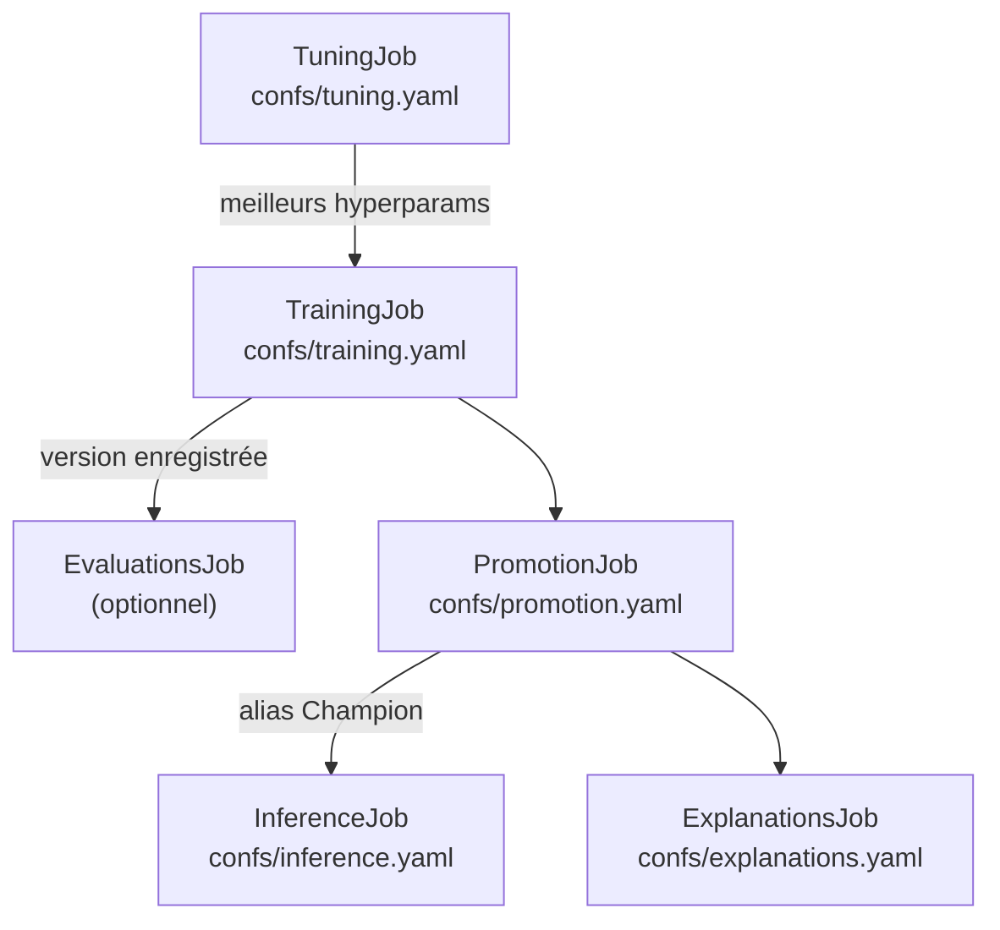

# Architecture du code

<div style="padding: 1rem 1.25rem; border-left: 0.28rem solid #448aff; background: rgba(68, 138, 255, 0.10); border-radius: 0.25rem; font-size: 1.08rem; line-height: 1.5;">
Le cœur data science du projet n'est pas un notebook ou un script isolé : c'est une architecture en couches — <strong>core</strong> (domaine), <strong>io</strong> (adaptateurs), <strong>jobs</strong> (orchestration), <strong>utils</strong> (briques techniques) — pilotée entièrement par des fichiers de config YAML (<strong>confs/</strong>) et tracée de bout en bout dans <strong>MLflow</strong>.
</div>

## Principe général

Chaque exécution (tuning, entraînement, évaluation, promotion, inférence) suit le même chemin, quel que soit le job :



- **Aucun paramètre n'est codé en dur dans les scripts** : tout vient d'un fichier YAML, validé par Pydantic. Changer de modèle, de splitter ou de jeu de données est une modification de config, pas de code.
- **Chaque classe métier (modèle, préprocesseur, splitter, searcher, reader...) déclare un champ `KIND` littéral.** Pydantic s'en sert comme discriminant pour choisir la bonne implémentation (`RandomForest` vs `XGBoost`, `CsvReader` vs `ParquetReader`, ...) directement depuis le YAML — un pattern de type "union discriminée", proche du polymorphisme, sans `if/else` de branchement.
- **Chaque `Job` est un context manager** ([src/agri/jobs/base.py](../src/agri/jobs/base.py)) : à l'entrée il démarre les services (logger, MLflow), à la sortie il les arrête proprement, même en cas d'erreur.

## `core/` — le domaine métier

Aucune dépendance vers MLflow, FastAPI ou Streamlit ici : uniquement de la logique data science pure, réutilisable partout (jobs, API, tests).

| Module | Rôle | Classes clés |
| --- | --- | --- |
| [constants.py](../src/agri/core/constants.py) | Données de référence partagées | `CROP_OPT_TEMPS`, `AREAS`, `ITEMS`, `CROP_REF_YIELD`, `DEFAULT_*` |
| [schemas.py](../src/agri/core/schemas.py) | Contrats de données (Pandera) | `InputsSchema`, `TargetsSchema`, `OutputsSchema`, `SHAPValuesSchema`, `FeatureImportancesSchema` |
| [features.py](../src/agri/core/features.py) | Feature engineering | `AgriFeatureEngineer`, `Preprocessor` / `AgriPreprocessor` |
| [models.py](../src/agri/core/models.py) | Modèles entraînables | `Model` (abstrait) → `RandomForest`, `XGBoost` |
| [metrics.py](../src/agri/core/metrics.py) | Évaluation de performance | `Metric` (abstrait) → `SklearnMetric`, `Threshold` |

- `Schema.check()` valide *et* coerce un dataframe pandas — utilisé aussi bien côté entraînement que côté API (`logic.predict_yield` valide chaque requête avec `InputsSchema.check`).
- `Model` définit une interface commune (`fit`, `predict`, `explain_model`, `explain_samples`, `get_params`/`set_params`) : `TrainingJob`, `TuningJob` et l'API manipulent un `Model` sans savoir s'il s'agit d'une forêt aléatoire ou d'un XGBoost.
- `Metric.to_mlflow()` convertit une métrique du projet en métrique MLflow (`mlflow.metrics.make_metric`), pour la réutiliser telle quelle dans `mlflow.models.evaluate`.

## `io/` — les adaptateurs

Tout ce qui parle à l'extérieur (fichiers, MLflow, logs) est isolé ici, derrière des interfaces abstraites — remplacer un CSV par un Parquet, ou SQLite par un serveur MLflow distant, ne touche à aucune ligne de `core/` ou `jobs/`.

| Module | Rôle | Classes clés |
| --- | --- | --- |
| [configs.py](../src/agri/io/configs.py) | Parsing des fichiers de config | `parse_file`, `parse_string`, `merge_configs`, `to_object` (OmegaConf) |
| [datasets.py](../src/agri/io/datasets.py) | Lecture/écriture de données | `Reader` → `CsvReader`, `ParquetReader` · `Writer` → `CsvWriter`, `ParquetWriter` |
| [registries.py](../src/agri/io/registries.py) | Sauvegarde/chargement/enregistrement de modèles | `Saver` → `CustomSaver`, `BuiltinSaver` · `Loader` → `CustomLoader`, `BuiltinLoader` · `Register` → `MlflowRegister` |
| [services.py](../src/agri/io/services.py) | Contextes globaux (logger, MLflow) | `Service` → `LoggerService`, `MlflowService` |

- `MlflowService` centralise tracking URI, registry URI, nom d'expérience et de registre — un seul endroit à changer pour passer d'un SQLite local à un serveur MLflow distant.
- `MlflowService.run_context()` est un context manager qui ouvre/ferme un run MLflow (`mlflow.start_run`) : c'est ce que chaque job utilise pour englober son exécution.
- Chaque `Reader` sait aussi produire sa **lineage** (`reader.lineage(...)` → `mlflow.log_input`) : MLflow trace non seulement les métriques, mais aussi *quelles données exactement* ont produit ce run.

## `jobs/` — les orchestrateurs

Chaque job assemble des briques `core`/`io`/`utils` pour réaliser une étape du cycle de vie MLOps, et l'enregistre systématiquement dans un run MLflow.



| Job | Fichier | Rôle |
| --- | --- | --- |
| `TuningJob` | [tuning.py](../src/agri/jobs/tuning.py) | Recherche d'hyperparamètres (`GridCVSearcher` ou `RandomizedCVSearcher`), un run MLflow imbriqué par combinaison testée |
| `TrainingJob` | [training.py](../src/agri/jobs/training.py) | Entraîne sur 100% d'une fenêtre récente du train (`training_window_years`), récupère les params du `TuningJob` **le plus récent** si `use_best_from_tuning: true`, signe, sauvegarde et **enregistre** le modèle |
| `EvaluationsJob` | [evaluations.py](../src/agri/jobs/evaluations.py) | Évalue une version enregistrée via `mlflow.models.evaluate`, vérifie des seuils (`Threshold`), tague la version |
| `PromotionJob` | [promotion.py](../src/agri/jobs/promotion.py) | Choisit la meilleure version évaluée (`R2_test`) et lui assigne l'alias `Champion` |
| `ExplanationsJob` | [explanations.py](../src/agri/jobs/explanations.py) | Calcule importances de features + valeurs SHAP sur un échantillon |
| `InferenceJob` | [inference.py](../src/agri/jobs/inference.py) | Génère des prédictions batch à partir d'une version enregistrée |

Tous héritent de `base.Job` ([jobs/base.py](../src/agri/jobs/base.py)), qui déclare le champ discriminant `KIND` ainsi que `logger_service`/`mlflow_service`, et impose une méthode abstraite `run() -> Locals`.

## `utils/` — les briques techniques

Des outils génériques, sans logique métier agricole, réutilisables par n'importe quel job d'entraînement/tuning.

| Module | Rôle | Classes clés |
| --- | --- | --- |
| [splitters.py](../src/agri/utils/splitters.py) | Découpage train/test | `Splitter` → `TrainTestSplitter`, `TimeSeriesSplitter`, `ExpandingWindowSplitter`, `RollingWindowSplitter` |
| [searchers.py](../src/agri/utils/searchers.py) | Recherche d'hyperparamètres | `Searcher` → `GridCVSearcher` (wrap `GridSearchCV`), `RandomizedCVSearcher` (wrap `RandomizedSearchCV`) |
| [signers.py](../src/agri/utils/signers.py) | Signature de modèle MLflow | `Signer` → `InferSigner` (`mlflow.models.infer_signature`) |

`RollingWindowSplitter` (splitter par défaut du tuning) et `ExpandingWindowSplitter` sont des exemples de logique **métier via la config** plutôt que du code : ils simulent des folds réalistes (entraîner sur le passé, tester sur l'année suivante), sélectionnés simplement en changeant `KIND:` dans [confs/tuning.yaml](../confs/tuning.yaml). `RollingWindowSplitter` fait glisser une fenêtre d'entraînement de taille **fixe** (`window=5` ans, `test_size=1` an, `step=1` — reproduit exactement le scénario de déploiement "ré-entraîner chaque année sur les 5 précédentes", cf. [notebooks/agri.ipynb](../notebooks/agri.ipynb)), tandis que `ExpandingWindowSplitter` (conservé pour comparaison/historique) fait grossir le train set à chaque fold en gardant tout l'historique. Les deux comptent les fenêtres en années **distinctes présentes** dans les données (`splitters.distinct_years`), pas en arithmétique calendaire — une année peut être totalement absente (ex. 2003 dans ce dataset).

## `confs/` — la configuration déclarative

Chaque fichier YAML sous [confs/](../confs/) correspond à un seul job, dont chaque section correspond à un champ Pydantic de ce job :

```yaml
# confs/training.yaml
job:
  KIND: TrainingJob          # -> agri.jobs.training.TrainingJob
  inputs:
    KIND: CsvReader          # -> agri.io.datasets.CsvReader
    path: data/processed/inputs_train.csv
  use_best_from_tuning: true
  training_window_years: 5   # ne fit que sur les 5 dernières années distinctes
  model:
    KIND: XGBoost            # -> agri.core.models.XGBoost
  metrics:
    - KIND: SklearnMetric
      name: RMSE
```

Exécution, deux façons équivalentes :

```bash
# via le point d'entrée CLI du package (src/agri/scripts.py)
uv run agri confs/training.yaml

# via MLflow Projects (MLproject), qui prépare l'environnement à partir de python_env.yaml
uv run mlflow run . -P conf_file=confs/training.yaml
```

`scripts.main()` parse le(s) fichier(s) YAML avec OmegaConf, les convertit en objet Python, les valide avec `MainSettings` ([settings.py](../src/agri/settings.py)) — c'est cette validation Pydantic (via le discriminant `KIND: job.KIND`) qui choisit et instancie la bonne classe de `Job`, puis l'exécute dans son context manager.

??? info "Annexes"

    ## Pourquoi cette architecture est "le cœur data science" du projet

    - **Reproductibilité** : un run = un fichier YAML versionné + un run MLflow. Rejouer une expérience passée, c'est reprendre son fichier de config, pas deviner quels arguments de script ont été utilisés.
    - **Traçabilité complète** : chaque job logge automatiquement params, métriques, tags, et la **lineage des données** (`mlflow.log_input`) — on peut remonter d'un modèle en production jusqu'au fichier CSV exact qui l'a entraîné.
    - **Extensibilité par ajout, pas par modification** : ajouter un nouveau modèle (ex. `LightGBM`) ou un nouveau splitter ne modifie aucun `Job` existant — on ajoute juste une classe avec un nouveau `KIND` à l'union discriminée (`ModelKind`, `SplitterKind`, ...).
    - **Séparation stricte des responsabilités** : `core/` ignore tout de MLflow ; `io/` ignore tout de la logique métier agricole ; `jobs/` orchestre sans réimplémenter ni l'un ni l'autre. Chaque couche se teste indépendamment (voir la structure de [tests/](../tests/), qui reflète exactement celle de `src/agri/`).
