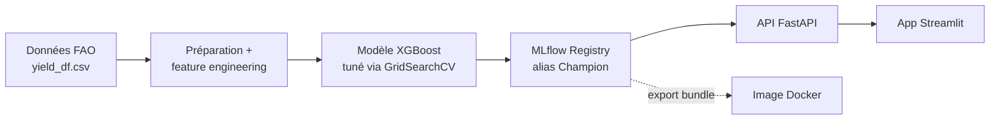

# Contexte du projet

Prédire et recommander des <strong>rendements agricoles</strong> à partir de données climatiques et agricoles (pluviométrie, pesticides, température), à partir du dataset FAO (Food and Agriculture Organization).

## Schéma général

L'API et le frontend sont déployés indépendamment :

- l'**API** est packagée dans une image Docker (le modèle `Champion` y est embarqué), construite et poussée sur Docker Hub par la CI/CD ;
- l'**application Streamlit** est déployée séparément sur Streamlit Community Cloud, connectée directement à ce dépôt GitHub.

## Stack MLOps

| Brique | Rôle |
| --- | --- |
| `pandera` | Validation des schémas de données (`InputsSchema`, `TargetsSchema`, `OutputsSchema`) |
| `scikit-learn` / `XGBoost` | Preprocessing (`TargetEncoder`) et modèle de régression |
| `SHAP` | Explicabilité du modèle (importances, valeurs SHAP) |
| `MLflow` | Tracking des expérimentations, model registry, alias `Champion` |
| `FastAPI` / `Pydantic` | Service HTTP de prédiction, validation des requêtes |
| `Streamlit` | Interface utilisateur métier |
| `Docker` / `Docker Hub` | Packaging et distribution de l'image de l'API |
| `GitHub Actions` | Tests, build et publication automatisés |
| `uv` / `just` | Gestion d'environnement et raccourcis de commandes |

## Pages de cette documentation

- **[Modèle](02_model.md)** — préparation des données, feature engineering, entraînement et tuning.
- **[API](03_api.md)** — le service FastAPI qui sert le modèle.
- **[Application](04_prediction.md)** — l'interface Streamlit.
- **[CI/CD](05_cicd.md)** — le pipeline de tests et de build.
- **[Dépôt](06_depot.md)** — structure du code et synthèse.
- **[Architecture du code](07_architecture.md)** — `core`, `io`, `jobs`, `utils`, `confs` : le cœur data science, piloté par MLflow.
