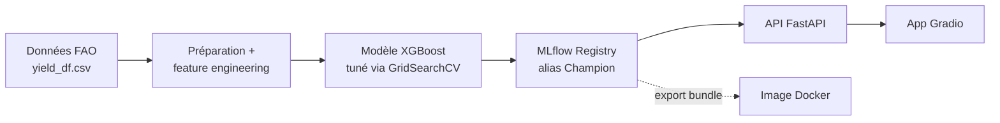

# Contexte du projet

Prédire et recommander des <strong>rendements agricoles</strong> à partir de données climatiques et agricoles (pluviométrie, pesticides, température), à partir du dataset FAO (Food and Agriculture Organization).

## Schéma général

```mermaid
flowchart LR
    A[Données FAO<br/>yield_df.csv] --> B[Préparation +<br/>feature engineering]
    B --> C[Modèle XGBoost<br/>tuné via GridSearchCV]
    C --> D[MLflow Registry<br/>alias Champion]
    D --> E[API FastAPI]
    E --> F[App Gradio]
    D -.export bundle.-> G[Image Docker]
```

L'API et le frontend sont déployés indépendamment, en deux services **Google Cloud Run** :

- l'**API** (modèle `Champion` embarqué) et l'**application Gradio** sont packagées dans deux images Docker distinctes, l'image UI étant volontairement légère (Gradio seul, sans stack ML) ;
- la CI/CD construit les deux images et les pousse sur Docker Hub, puis les déploie sur Cloud Run : [agri-api](https://agri-api-28873275232.europe-west1.run.app/docs) et [agri-ui](https://agri-ui-28873275232.europe-west1.run.app) — détail dans [CI/CD](05_cicd.md).

## Stack MLOps

| Brique | Rôle |
| --- | --- |
| `pandera` | Validation des schémas de données (`InputsSchema`, `TargetsSchema`, `OutputsSchema`) |
| `scikit-learn` / `XGBoost` | Preprocessing (`TargetEncoder`) et modèle de régression |
| `SHAP` | Explicabilité du modèle (importances, valeurs SHAP) |
| `MLflow` | Tracking des expérimentations, model registry, alias `Champion` |
| `FastAPI` / `Pydantic` | Service HTTP de prédiction, validation des requêtes |
| `Gradio` | Interface utilisateur métier |
| `Docker` / `Docker Hub` | Packaging et distribution des images de l'API et de l'UI |
| `GitHub Actions` | Tests, build, publication et déploiement automatisés |
| `Google Cloud Run` | Hébergement des deux services (scale-to-zero), images tirées depuis Docker Hub |
| `uv` / `just` | Gestion d'environnement et raccourcis de commandes |

## Pages de cette documentation

- **[Modèle](02_model.md)** — préparation des données, feature engineering, entraînement et tuning.
- **[API](03_api.md)** — le service FastAPI qui sert le modèle.
- **[Application](04_prediction.md)** — l'interface Gradio.
- **[CI/CD](05_cicd.md)** — le pipeline de tests, de build des images et de déploiement sur Cloud Run.
- **[Dépôt](06_depot.md)** — structure du code et synthèse.
- **[Architecture du code](07_architecture.md)** — `core`, `io`, `jobs`, `utils`, `confs` : le cœur data science, piloté par MLflow.
